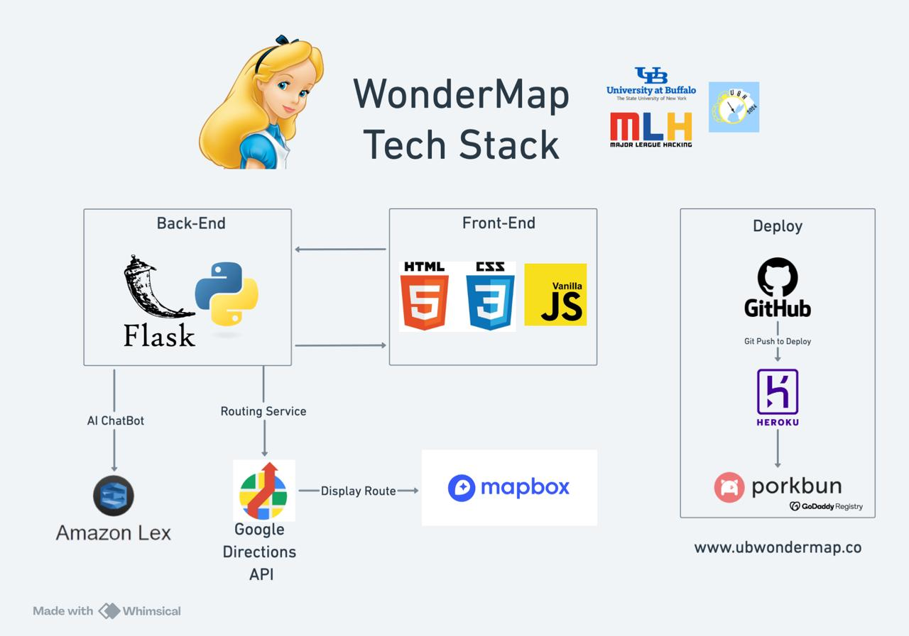

# UB Wonder Map
## Inspiration
We wanted to create a game accessible to every UB students in the theme of Alice in Wonderland for the UB Hackaton. Our goal was to combine a modern, design and simple UI/UX to an AI chatbot emboded by Alice in Wonderland.

## What it does
The user can view a 3D Map of UB and discuss to Alice. Alice is able to answer questions, provide riddles and show the user its path on the map. She would never let the user lost on campus.

Try it yourself: http://www.ubwondermap.co/

## How we built it

We tried to make the best use of UB Hacking’s sponsors’ platform (We would like to express our gratitude to AWS, Porkbun, and GoDaddy Registry).

## Challenges we ran into
One of the main challenge was to find the best way to configure AWS Lex to enhance user experience in the theme of Alice in Wonderland. It was our first challenge involving AI ChatBot, but AWS API makes it easy to quickly implement it in our project.
We have spent a lot of time fine tuning the UI/UX to offer the best experience for the user, we aimed for a balance between minimalism and practicality.

## Accomplishments that we're proud of
Our goal was to leverage reliable technology to offer an application that could entertain student while helping them. The project involves the intercommunication of multiple industry-standard solutions that we’ve studied and developed a good understanding of. We’re excited to use them again for our next projects.

## What we learned
One of the main things that we had learn was to stay organized and maintain a functional scope that is achievable by making compromises as we develop. 
We also got familiar with new tools that we’re happy to continue exploring; it opens new perspectives and ideas to delve into.

Just like Alice would say: “Curiouser and curiouser!” (Carroll, 1865, p. 18).

_Carroll, L. (1865). Alice’s adventures in Wonderland. Macmillan._

